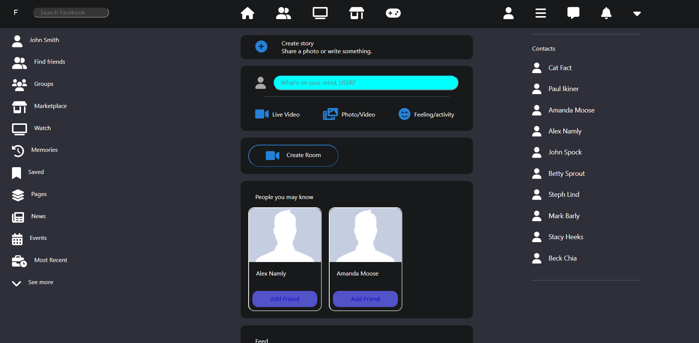
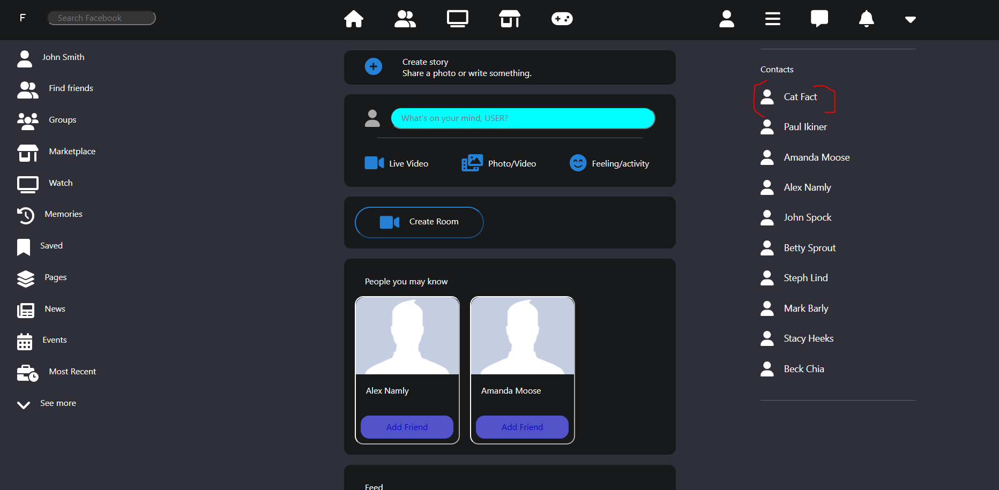
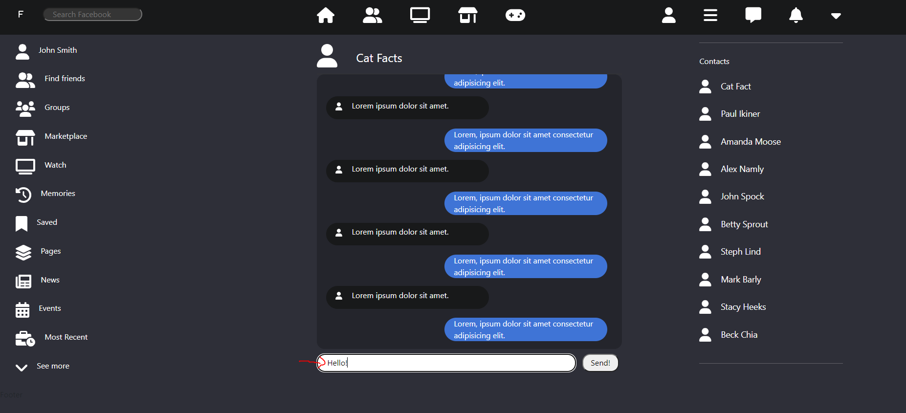
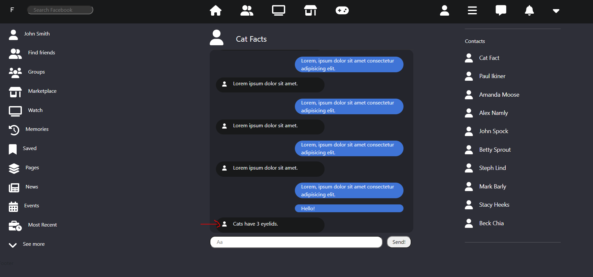
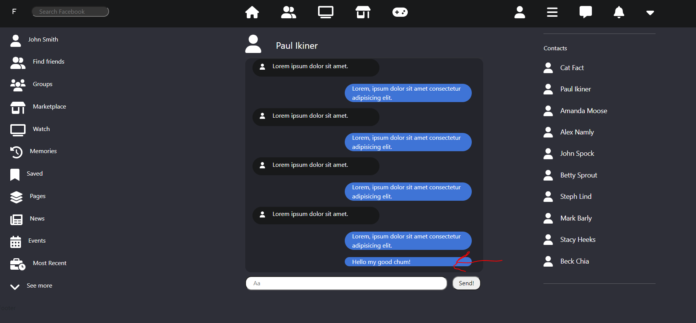

# Getting Started with Create React App

1. `npm install`
2. `npm start`

 

# NPM Packages in use

1. Font Awesome:
    - `"@fortawesome/fontawesome-svg-core": "^1.3.0"`
    - `"@fortawesome/free-regular-svg-icons": "^6.0.0"`
    - `"@fortawesome/free-solid-svg-icons": "^6.0.0"`
    - `"@fortawesome/react-fontawesome": "^0.1.17"`
        - Used to import and place standard/general icons

2. Bootstrap
    - `"bootstrap": "^5.1.3"`
    - `"react-bootstrap": "^2.0.3"`
        - Used for broad stroke general components, containers, styles, etc.
        - Mostly used in this app for a quick "three even column" setup.

3. Sass/scss
    - `"node-sass": "^4.14.1"`
        - Used to write scss which is then translated to css in React.
        - Prefer the syntax and nesting features over standard css.

4. React Router Dom
    - `"react-router-dom": "^5.1.2"`
        - Used for routing

 

# Current Features
1. Frontend Facebook landing: Navigation, Sidebar, and Contacts
    - Basic HTML/CSS setup of Facebook upon entering the home page
2. Messenger
    - Basic messenger JSX/CSS setup that allows a user to send messages.
    - Also, if the user selects cat facts in the contacts list, whenever the user sends a message, a cat fact is promptly sent back

 

# Tour
### Immediate landing page view
- Left Sidebar with different potential features
- Center component with frontend potential features: Create Story, Create Post, People you may know, etc
- Right Sidebar with Contacts list that can be clicked on which will redirect user to a frontend Messenger feature

 
 

### About to select Cat Facts in the Contacts list

### Immediate view upon selecting Cat Facts

### Sending a message!

### Cat Fact received!

 
 

### Home page --> about to select a regular contact

### Imediate view upon selecting a regular contact (with a message typed out)

### Message sent!
